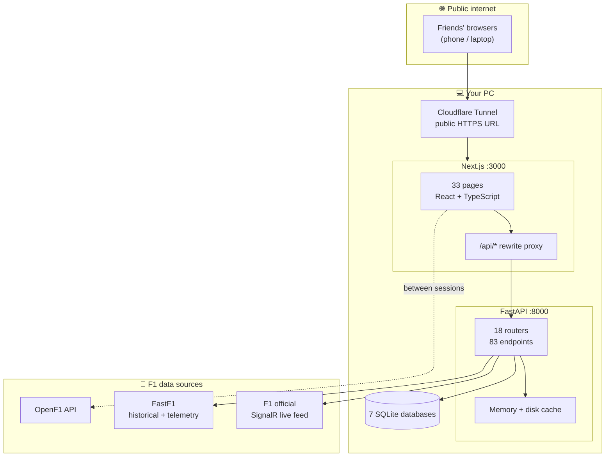

# F1 Dashboard — Complete Project Documentation

**"Race Weekend OS"** — a Formula 1 companion web app. The design goal: a fan opens the site on Friday before FP1 and never needs another tab until the podium.

Last updated: 7 July 2026

---

## 1. What it is, in one paragraph

This is a full-stack web application that pulls **real Formula 1 data** — live timing during sessions, historical results, telemetry, standings — and wraps it in a fan platform: live race timing, an interactive track map, race predictions, fantasy teams, a chat/watch-party, an AI race engineer, quizzes, a social feed, achievements, and a multi-screen "cockpit" view. It runs entirely on your own machine and can be published to the internet on demand.

It is **not** a template or a site builder export. Every page, endpoint, and database table was written from scratch for this project.

---

## 2. At a glance

| Metric | Count |
|---|---|
| Lines of code | **~21,500** (16,100 frontend · 5,400 backend) |
| Pages / routes | **33** |
| API endpoints | **83** across **18** routers |
| React components | **42** |
| Shared frontend modules (`lib/`) | **15** |
| Databases | **7** SQLite files |
| Build phases completed | **11 of 13** + accounts |

---

## 3. The tech stack — what it's built ON

### Frontend (the website)

| Technology | Version | What it does here |
|---|---|---|
| **Next.js** | 16.2.9 | The web framework. App Router, server-side rendering, production builds, and the `/api` proxy used for public hosting |
| **React** | 19.2.4 | The UI library — every page is a React client component |
| **TypeScript** | 5.x | Type safety across the whole frontend. The codebase compiles with **zero type errors** |
| **Tailwind CSS** | 4.x | Present and used by a few UI components; the app's own styling is deliberately **inline styles + a hand-written design system** in `globals.css` |
| **Framer Motion** | 12.x | All animation — tower row reordering, page transitions, emoji rain, toasts, staggered reveals |
| **Recharts** | 3.9.2 | Charts on `/battle`, `/analysis`, `/standings` and `/driver-stats` (radar, line, bar, scatter, box, Sankey) |
| **Lucide React** | 1.x | The icon set used site-wide |
| **GSAP** | 3.x | Morphing icon animations in the nav dock |

The bottom dock carries seven controls — Home, four **groups** (Racing · Analysis · Reference · Play) and Search + Profile. Selecting a group opens a labelled panel listing that group's routes with descriptions; it replaced a flat strip of 25 icons.
| **SWR** | 2.x | Data-fetching helper |
| **date-fns** | 4.x | Date handling |

### Backend (the data server)

| Technology | What it does here |
|---|---|
| **Python 3 + FastAPI** 0.138.1 | The API server — 83 endpoints, automatic validation via Pydantic |
| **Uvicorn** | The ASGI web server that runs FastAPI |
| **FastF1** | The core F1 data library — schedules, results, laps, telemetry, circuit geometry, weather |
| **pandas / NumPy** | Data processing for every analytics and results endpoint |
| **signalrcore** | Connects to F1's **official live timing feed** (see §5) |
| **httpx / requests** | HTTP clients for external APIs |
| **anthropic** | Powers the AI Race Engineer (optional — falls back gracefully without a key) |
| **SQLite** (stdlib) | All persistent storage — 7 databases |

### Hosting / infrastructure

| Tool | Role |
|---|---|
| **Cloudflare Tunnel** (`cloudflared`) | Publishes the locally-running site to a public HTTPS URL with no account or port-forwarding |
| **Next.js rewrites** | Proxies `/api/*` to the backend so only one public URL is exposed |

---

## 4. Architecture — how the pieces fit



**The key design decision:** the backend is never exposed to the internet. Visitors only ever reach the Next.js server, which forwards API calls internally. This means one public link, and the database and admin docs stay unreachable from outside.

---

## 5. Data sources — the three-source strategy

This is the most technically interesting part of the project, and it exists because of a hard problem: **the free F1 data API shuts off exactly when you need it most.**

| Source | When it's used | Why |
|---|---|---|
| **F1 official SignalR feed** | **During live sessions** | OpenF1's free tier returns `401` for its entire API while any session is running. The backend connects *anonymously* to Formula 1's own live-timing stream instead — the same feed the official app uses. Gives live positions, gaps, sectors, tyres, race control, weather |
| **OpenF1** | Between sessions | Free, convenient, and fine when nothing is running |
| **FastF1** | Historical + telemetry | Race results, lap times, stints, circuit geometry, corner data, driver info. Slow on first load (30–90s), then cached |
| **Jolpica** | Historical archive | Replacement for the retired Ergast API |

The frontend (`lib/live.ts`) automatically fails over between sources, so live timing keeps working whichever one is available.

**Caching**, because FastF1 is slow:
- **Memory cache** — 5-minute TTL for frequently-changing data
- **Disk cache** — permanent, for finished race results (they never change)
- **Negative cache** — 180-second backoff when a session isn't archived yet, so the server doesn't retry a slow failing lookup on every request

---

## 6. Every feature, explained

### Race data & timing

| Page | What it does |
|---|---|
| **`/live`** | The live timing tower — position, gaps, intervals, last/best lap, **colour-coded sector times** (purple/green/yellow), tyre compound + age, pit stops. Plus race control messages, weather, and a mini track map. Includes the alerts bell and pop-out buttons |
| *(live extras)* | **Mini-sectors** — each sector split into segments (24 per lap at Zandvoort), coloured live from F1's own timing feed; **Timing / Stints** views; **Best Lap Benchmarks**; **Team Radio**; and a **broadcast delay** (Off–2m) that holds the whole feed back to match a delayed TV stream. Mini-sectors and radio need the F1 bridge — on the OpenF1 fallback they're hidden rather than broken |
| **`/map`** | Full-page interactive circuit map — real track outline with correct rotation, numbered corners, marshal mini-sectors that **turn yellow when a flag is thrown in that sector**, approximated DRS/AoA zones, live car dots you can click for a detail panel, and a wind compass |
| **`/standings`** | Full drivers' and constructors' championship tables |
| **`/calendar`** | All 22 rounds with session times in IST, countdowns, sprint markers, and calendar sync |
| **`/race/[round]/…`** | Per-weekend hub with dedicated results pages for practice, qualifying, sprint, and race |
| **`/drivers`, `/teams`, `/circuits`** | Reference pages with detail views |
| **`/telemetry`** | Car-data comparison between drivers |
| **`/season-stats`, `/history`** | Season aggregates and all-time records |

### Analytics

| Page | What it does |
|---|---|
| **Season switch** | 2026 / 2025 / 2024 on standings, results, schedule, drivers, calendar, analysis and driver stats. Picker sits top-right on those routes and persists; the home page stays pinned to the current season because it shows "next session" and the live pill |
| **`/follow`** | **Follow Along** — the watch-along screen. Pin a driver (optional) and the page centres on them: position, gap, interval, mini-sectors, stints, cars ahead/behind and season form, over the full timing tower. Pinning a driver also arms the alert engine for them, so there's no separate alert setup. Carries the same data as `/live` — weather, track map, best-lap benchmarks, team radio — plus a session clock (time left, and time to the next session) |
| **`/battle`** | Driver-vs-driver hub — season head-to-head, a radar comparison, qualifying H2H, race-pace lines (filtered to drop in/out laps), sector deltas, and start-performance visuals |
| **`/analysis`** | The analysis hub — **nine tabs in three groups**. *Performance:* race pace, fuel-corrected pace ranking, tyre degradation, **Track DNA** (circuit fingerprint from fastest-lap telemetry). *Comparison:* head-to-head, consistency box plots, pit-lane time loss. *Simulation:* **Strategy Simulator 2.0** — a stint timeline with adjustable pit laps, safety-car laps and rain-from-lap toggles that re-predict the finishing order — and a championship projector. Deep-linkable via `?tab=` |
| **`/driver-stats`** | Per-driver season breakdown — KPI tiles, a Start→Finish position-flow Sankey, finish distribution, points evolution, laps led |
| **`/analytics`** | Retired. Redirects to `/analysis?tab=pace-ranking` — the two hubs overlapped, so they were merged |

### Games & competition

| Page | What it does |
|---|---|
| **`/predictor`** | Pick pole, the podium in order, fastest lap, first DNF, safety-car count, red flags, and biggest gainer/loser. **Locks automatically at qualifying.** After the race, auto-scores against real results (120 points max) and pays out Pit Coins |
| **`/fantasy`** | PickStop — 5 drivers + a constructor per round, a captain worth 2×, and a boost shop (Engine Upgrade, Undercut, Pit Crew, Weather Boost) bought with Pit Coins. Locks at race start, scores from real results |
| **`/quiz`** | 10 questions daily, generated from **real season data** and deterministic per date (everyone gets the same quiz). Streaks, leaderboard, coin rewards |
| **`/games`** | Reaction-time start-lights game that pays Pit Coins |
| **`/profile`** | Account card, Pit Coins balance, and the badge cabinet — **15 achievements** with locked/secret states |

### Community

| Page | What it does |
|---|---|
| **`/paddock`** | Watch party — live session rooms that auto-appear, **live polls** with animated bars, **emoji storms** that rain across everyone's screen, message reactions, pinned messages, a sticker set, and a **spoiler shield** that blurs messages newer than your stream delay (essential if you're on a delayed feed) |
| **`/feed`** | Social feed — posts with images and driver/team tags, likes, comments, reposts, follows, hot/new/following sorting, plus report and delete-own moderation |
| **`/engineer`** | AI Race Engineer — ask questions and get answers in pit-wall radio style, with live session context. Runs on **Gemini or Claude** — set `GEMINI_API_KEY` (or `GOOGLE_API_KEY`) or `ANTHROPIC_API_KEY` in the backend environment. Gemini wins if both are present; `ENGINEER_PROVIDER` forces one. Model ids override via `GEMINI_MODEL` / `ANTHROPIC_MODEL`. With no key it answers from the same real data with a rule-based fallback, so the page never dead-ends |

### Power-user tools

| Feature | What it does |
|---|---|
| **`/battlestation`** | Multi-pane cockpit — 4 layout presets, swappable panes (map, timing, paddock, engineer, telemetry, widgets), auto-saved layout, fullscreen |
| **`/widget/[type]`** | Pop-out mini windows (timer, gaps, standings, weather) that open chrome-free for a second monitor |
| **Alerts engine** | 7 live rules — your driver pits, position changes, fastest lap, safety car, red flag, rain, penalties → in-app toast + browser notification + sound |
| **Calendar sync** | Exports proper `.ics` calendar files with 30-minute reminders, plus one-click Google Calendar links per session |

---

## 7. Data storage

Seven SQLite databases, each owned by one feature:

| Database | Holds |
|---|---|
| `users.db` | Accounts + sessions |
| `predictor.db` | Race predictions and scores |
| `fantasy.db` | Fantasy teams per round and scores |
| `community.db` | Chat messages, polls, votes, reactions |
| `feed.db` | Posts, likes, comments, follows, reports |
| `quiz.db` | Daily quiz attempts and streaks |
| `popularity.db` | Driver interaction events (the "Paddock Pulse") |

### Accounts & security

- Passwords are **never stored** — only PBKDF2-SHA256 hashes with a per-user random salt and **200,000 iterations**
- Sessions are server-side opaque tokens with a 30-day expiry, revoked on sign-out
- The account username *is* the paddock name every feature keys on — so registering with an existing name **adopts all your previous history** (predictions, teams, posts, coins)

> **Before making this permanently public**, two hardening steps are pending: move tokens into httpOnly cookies, and add rate-limiting on the login endpoint.

---

## 8. The design system — "Pit Wall"

The visual language was deliberately rebuilt away from generic dark-glassmorphism into something with racing-engineering character:

- **Typography** — *Chakra Petch* (italic caps display, the racing lean) · *Archivo* (body) · *IBM Plex Mono* (all timing numbers, tabular)
- **Panels** — flat carbon surfaces with 2px corners and **red registration-mark brackets**, like technical drawings. No frosted glass
- **Background** — a faint blueprint grid with a red halo, evoking pit-lane sodium light
- **Details** — section labels with square markers, `//` code-comment kickers, a film-grain overlay, hazard-tape accents

All of it is defined once in `app/globals.css` so the whole site changes from one file.

---

## 9. How it gets published

The site runs on your PC and is exposed via **Cloudflare Tunnel**:

1. **Backend** starts on port 8000
2. **Frontend** is built for production and starts on port 3000
3. **`cloudflared`** creates a public HTTPS URL pointing at port 3000
4. Next.js internally proxies `/api/*` → `127.0.0.1:8000`

**One-click launcher:** `GO-LIVE.cmd` in the project root does all four steps and prints the public link.

### Known limitations of this approach

- Your **PC must stay on and awake**, with the server windows open
- The public URL **changes every restart** (a free-tunnel limitation) — you must re-share it
- Traffic passes through your home internet connection

**The permanent fix** is Phase 12: frontend → Vercel, backend → Railway or Fly.io (needs always-on hosting for the live-timing bridge), SQLite → Postgres. That gives a fixed URL that works whether or not your PC is on.

---

## 10. Running it

**Easiest — publish to friends:**
```
Double-click GO-LIVE.cmd  →  copy the printed https://….trycloudflare.com link
```

**Manually, for local development:**
```bash
# Backend
cd "C:\Projects\F1 DASHBOARD PROJECT\f1-dashboard\backend"
python -m uvicorn main:app --port 8000

# Frontend (separate window)
cd "C:\Projects\F1 DASHBOARD PROJECT\f1-dashboard\frontend"
npm run dev          # development
npm run build && npx next start   # production (much faster)
```

Then open `http://localhost:3000`.

**Keyboard shortcuts:** `h` home · `l` live · `t` standings · `c` calendar · `r` predictor · `f` fantasy · `p` paddock · `g` games · `a` analysis · `x` telemetry · `b` battlestation · `u` profile · `s` search

---

## 11. Where everything lives

```
C:\Projects\F1 DASHBOARD PROJECT\
├── GO-LIVE.cmd              ← one-click public launch
├── DOCUMENTATION.md         ← this file
├── f1-dashboard\
│   ├── ROADMAP.md           ← the 13-phase build plan + what's done
│   ├── backend\
│   │   ├── main.py          ← registers all 18 routers
│   │   ├── utils.py         ← caching helpers
│   │   ├── requirements.txt
│   │   ├── routers\         ← 18 files, 83 endpoints
│   │   ├── data\            ← circuit + team reference data
│   │   ├── cache\           ← FastF1 + API disk cache
│   │   └── *.db             ← 7 SQLite databases
│   └── frontend\
│       ├── app\             ← 33 page routes (Next.js App Router)
│       ├── components\      ← 42 React components
│       ├── lib\             ← 15 shared modules (live.ts, auth.ts, wallet.ts…)
│       └── next.config.ts   ← API proxy + tunnel config
└── VengenceUI\              ← UI component source library
```

**Key files worth knowing:**

| File | Why it matters |
|---|---|
| `frontend/lib/live.ts` | The live-timing engine — source failover, feed mapping, position handling |
| `frontend/lib/auth.ts` | Account state and session tokens |
| `frontend/lib/wallet.ts` | Pit Coins + paddock identity |
| `frontend/lib/achievements.ts` | The 15 badges and their unlock rules |
| `frontend/app/globals.css` | The entire Pit Wall design system |
| `backend/routers/livetiming.py` | The SignalR bridge to F1's official feed |
| `backend/main.py` | Router registration — add new routers here |

---

## 12. Build status

| Phase | Status |
|---|---|
| 1 — Race weekend essentials (calendar sync, sectors, track map) | ✅ Done |
| 2 — Race Predictor | ✅ Done |
| 3 — Watch Party (Paddock 2.0) | ✅ Done |
| 4 — Achievements + Pit Coins economy | ✅ Done |
| 5 — PickStop (Fantasy 2.0) | ✅ Done |
| 6 — AI Race Engineer | ✅ Done *(add `GEMINI_API_KEY` or `ANTHROPIC_API_KEY` for full AI)* |
| 7 — Analytics Glow-Up (Battle Hub, Strategy Sim) | ✅ Done |
| 8 — Interactive Track Map 2.0 | ✅ Done |
| 9 — Daily Quiz + Popularity Index | ✅ Done |
| 10 — Social Feed | ✅ Done |
| 11 — Alerts, Widgets, Battlestation | ✅ Done |
| **Accounts / login** | ✅ Done (pulled forward from Phase 12) |
| 12 — Go Online (cloud deploy, Postgres, web push, PWA) | ⏳ Pending — needs Vercel + Railway accounts |
| 13 — Platform & revenue (public API, premium tier) | ⏳ Future |

---

## 13. Honest notes & known limitations

- **Pit Coins are client-side.** Balances live in the browser, so they're trust-based. Fine locally; needs server-side validation before any competitive or public use
- **Live features need a live session** to fully prove out — car dots on the map, alerts, and the watch party only animate during an actual F1 session
- **DRS/AoA zones are approximated** from track curvature — FastF1 doesn't publish real zone data, and the map labels them as approximate
- **Pit lane isn't drawn** on the track map — no data source provides it
- **First load after a restart is slow** (30–90s) while FastF1 fetches and caches. The launcher pre-warms caches to hide this
- **Tunnel URLs rotate** on every restart

---

*Built with Claude Code. Every feature above is working and was verified in a browser.*
